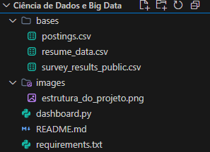

# Dashboard de Impacto - Global Talent Bridge

Este projeto contém o Dashboard interativo desenvolvido para a **Entrega 2 do Projeto Interdisciplinar (PI)**. O objetivo da aplicação é apresentar de forma visual o impacto econômico e social gerado pelo modelo de negócio da Startup (*Talent as a Service* - TaaS).

## 🚀 Passo a Passo: Como executar o projeto (Tutorial Detalhado)

Para visualizar o dashboard rodando no seu computador, siga **exatamente** as etapas abaixo. Preparamos este tutorial passo a passo para que você consiga executar a aplicação do zero, sem dificuldades!

### Passo 1: Preparar o ambiente
1. Você precisa ter o **Python** instalado no seu computador.
2. Faça o download de todos os arquivos deste repositório do GitHub e extraia a pasta no seu computador (por exemplo, na sua Área de Trabalho ou Documentos).

### Passo 2: Baixar as Bases de Dados (Google Drive)
Como o GitHub possui um limite rígido de 100MB para arquivos e nossas bases de dados somam mais de 600MB, elas foram alocadas em uma pasta externa no Google Drive.
1. Acesse o seguinte link do Google Drive: [Clique aqui para baixar as bases](https://drive.google.com/drive/folders/1S4ftCwdUUjFgedF65Lx0PNmZnzLqfal1?usp=sharing).
2. Faça o download dos 3 arquivos CSV presentes na pasta:
   - `postings.csv`
   - `resume_data.csv`
   - `survey_results_public.csv`
   *(Atenção: o download pode demorar alguns minutos dependendo da sua conexão de internet).*

### Passo 3: Organizar a Estrutura de Pastas
Para que o código consiga achar as bases de dados, os arquivos CSV que você acabou de baixar precisam estar no local correto.
1. Abra a pasta do projeto que você baixou do GitHub (a pasta onde este arquivo `README.md` e o arquivo `dashboard.py` se encontram).
2. Crie uma nova pasta dentro dela chamada exatamente: `bases` (tudo minúsculo).
3. Mova os 3 arquivos `.csv` que você baixou do Google Drive para dentro dessa nova pasta `bases`.

No final, a estrutura do seu projeto **deve ficar exatamente assim**:



### Passo 4: Abrir o Terminal e Instalar Bibliotecas
1. Abra a pasta principal do projeto.
2. Clique na barra de endereços da pasta lá no topo (onde diz o caminho, como `C:\Users\Nome\...\Ciência de Dados e Big Data`), apague o que está escrito, digite **`cmd`** e aperte **Enter**. Isso abrirá uma tela preta (Prompt de Comando) já na pasta correta.
3. Agora precisamos instalar as ferramentas que o Dashboard usa para criar os gráficos. Digite o seguinte comando nessa tela preta e aperte **Enter**:
   ```bash
   pip install -r requirements.txt
   ```
4. Aguarde algumas barrinhas carregarem. Quando o texto parar de rolar e você puder digitar novamente, a instalação terminou.

### Passo 5: Executar o Dashboard!
1. Ainda na tela preta (Prompt de Comando), digite o comando abaixo e aperte **Enter**:
   ```bash
   python -m streamlit run dashboard.py
   ```
2. **Pronto!** Aguarde alguns segundos. O seu navegador padrão (Google Chrome, Edge, etc.) vai abrir uma nova aba automaticamente acessando o endereço `http://localhost:8501`.
3. Aproveite a exploração interativa dos gráficos e dos dados da nossa Startup!

*(Dica: Para fechar o dashboard depois de usar, basta fechar a aba do navegador e fechar a tela preta do Prompt de Comando).*

## 📊 Estrutura do Dashboard e Indicadores

A interface é dividida em uma barra lateral de filtros e duas abas principais de análise.

### Filtros (Barra Lateral)
- **Filtro por Países**: Permite selecionar os países cujas distribuições salariais você deseja comparar. O padrão já vem pré-selecionado com Brasil, EUA e Alemanha.
- **Filtro por Habilidades**: Permite escolher uma habilidade técnica específica para observar o contexto social.

### Aba 1: Impacto Econômico (Arbitragem Cambial)
Nesta seção, o foco está na demonstração do potencial financeiro de conectar talentos locais a vagas globais:
- **KPI - Mediana Salarial Anual (Brasil)**: Exibe a mediana salarial em dólar (USD) de profissionais baseados no Brasil.
- **KPI - Potential Upside (EUA vs BR)**: Exibe o percentual de diferença entre a mediana salarial dos EUA comparada ao Brasil. Isso ilustra o conceito de "Arbitragem Cambial", demonstrando o ganho potencial ao se alocar um talento brasileiro em uma empresa internacional.
- **Gráfico de Distribuição Salarial**: Um gráfico *Boxplot* que exibe e compara visualmente a dispersão dos salários anuais entre os países selecionados no filtro.
- **Gráfico de Vagas (Presencial vs. Remoto)**: Um gráfico de rosca baseado em dados reais do LinkedIn, evidenciando a parcela do mercado de trabalho global que aceita ou possui o formato remoto.

### Aba 2: Impacto Social (Mapeamento de Talentos)
Esta seção mapeia os recursos humanos disponíveis na base e ilustra como a startup contribui para recolocar profissionais ou valorizar competências:
- **Gráfico Top 15 Habilidades Mais Frequentes**: Um gráfico de barras horizontais que contabiliza quais são as competências técnicas (skills) mais abundantes na base de currículos. Ajuda a entender qual é o "perfil" da mão-de-obra ofertada pela startup.
- **Visualização da Base de Currículos**: Uma tabela interativa (expansível) para auditoria dos dados de candidatos.
